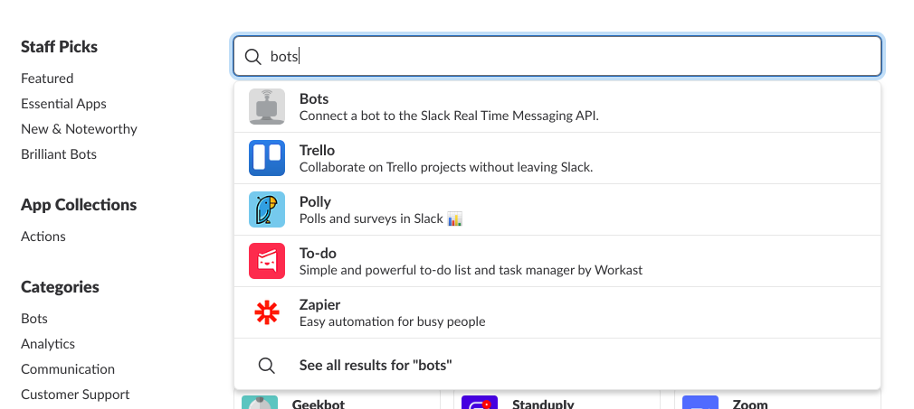
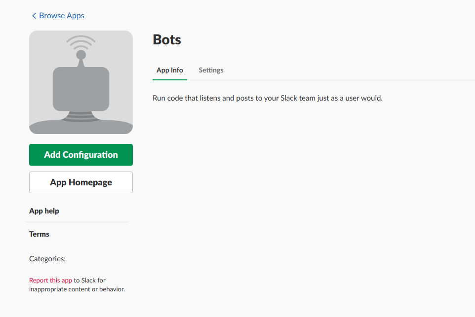
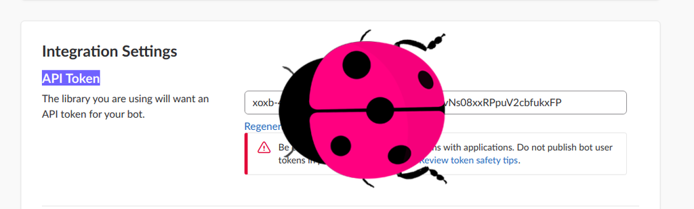

Slackish
========
Slackish is small library that lets you convert you simple functions into running slack bots.


Usage
-----
```python
from slackclient import SlackClient
from slackish import Slackish, Command

@Command
def create(campaign, on='Bing'):
    Slackish.send("Campaign created succesfully on {}!".format(on))

config = {}
config['BOT_ID'] = None
config['RTM_READ_DELAY'] = 1
config['SLACK_BOT_TOKEN'] = ''
config['SLACK_MENTION_REGEX'] = "^<@(|[WU].+?)>(.*)"
my_bot = Slackish(SlackClient, Command.registry, **config)
my_bot.serve()
```
<h2>Instlation Procces</h2>
<hr>
<h3> Open your slack channel 
<br>Select bots
</h3>

<h3>Create your app</h3> 


<h3>Get the access tokens and connect it to your code</h3> 


```
config['SLACK_BOT_TOKEN'] = 'Add Your access API Token'
```

after running the code above

check that your app is Active on Slack 
