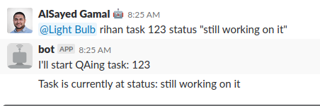
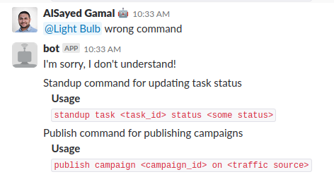
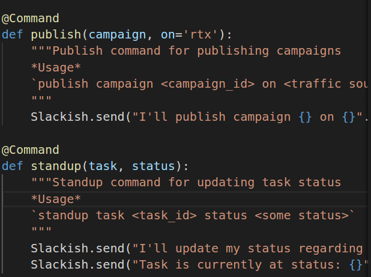

Slackish
========
Slackish is small library that lets you convert your simple python functions into running slack bots.

Sample Bot
-----
```python
from slackclient import SlackClient
from slackish import Slackish, Command

@Command
def publish(campaign, on='rtx'):
    """Publish command for publishing campaigns
    *Usage*
    `publish campaign <campaign_id> on <traffic source>`
    """
    Slackish.send("I'll publish campaign {} on {}".format(campaign, on))

@Command
def standup(task, status):
    """Standup command for updating task status
    *Usage*
    `standup task <task_id> status <some status>`
    """
    Slackish.send("I'll update my status regarding task: {}".format(task))
    Slackish.send("Task is currently at status: {}".format(status))


config = {}
config['BOT_ID'] = None
config['RTM_READ_DELAY'] = 1
config['SLACK_BOT_TOKEN'] = 'SOME-TOKEN'
config['SLACK_MENTION_REGEX'] = "^(<@(|[WU].+?)>)?(.*)"
my_bot = Slackish(SlackClient, Command.registry, **config)
my_bot.serve()
```
<h2>Installation</h2>
<hr>
<h3> Open your slack channel 
<br>Select bots
</h3>

<h3>Create your app</h3> 


<h3>Get the access tokens and connect it to your code</h3> 


```
config['SLACK_BOT_TOKEN'] = 'Add Your access API Token'
```
after running the code above

check that your app is Active on Slack 
<hr>

<h4>Help needed!!</h4>
Don't worry we handeled it




